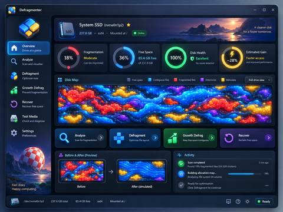

# Defragmenter UI vision

This document records the graphical north star for the Defragmenter desktop interface.

## Core intent

Defragmenter should feel graphical, premium, colourful, modern, GUI-first,
welcoming and visually rich. It should not present itself like a command-line
front end, an administrative form, or an early-alpha storage utility.

The visual spirit comes from Amiga/Workbench-era desktop computing: information
is something the user can see and manipulate, not merely read. The implementation
is contemporary GTK rather than a retro imitation.

## Visual direction

- The disk map is a **continuous pixel raster**, not a visible square-cell grid.
  Every display pixel is positional: left-to-right and then top-to-bottom must
  advance monotonically through the real on-disk allocation-unit address space.
  The renderer must never use Hilbert, Morton/Z-order or another aesthetic
  remapping that moves a physical allocation unit to a different apparent disk
  position. Higher drawing resolution requests more source cells from the analyser
  but never changes their physical ordering.
- The main window uses a graphical navigation rail, a selected-volume hero card,
  visual summary cards, a dominant disk-map canvas and large operation cards.
- Detailed logs remain available, but are secondary and collapsed by default.
- Common continues to own the suite typography, semantic Day/Night palette and
  neutral design metrics. Defragmenter adds only product-specific presentation
  and allocation-map category colours.
- Storage safety, operation semantics and filesystem engines remain independent
  of the presentation redesign.

## First-pass implementation

The first pass establishes the new composition without rewriting the application:
a wider dashboard canvas, graphical sidebar, hero volume selector, accented
summary cards, pixel-raster disk map, large operation cards and a compact
activity surface. Further passes can refine animation, preview states, richer
drive artwork and before/after visualisations without changing the storage
engine contract.

## Navigation contract

The left rail is **navigation**, not a second copy of the operation controls.
Overview is the graphical at-a-glance dashboard and may contain quick-action
cards. Analyse, Defragment, Growth Defrag, Recover, Test Media and Settings each
open their own section with the information and controls relevant to that task.
A sidebar click must never silently execute a destructive or long-running
operation.

## Raster-art contract

Where the approved concept uses illustration or product artwork, Defragmenter
uses dedicated standalone raster assets rather than procedurally redrawing the
scene with Cairo primitives. Runtime artwork lives under `gui/ui/art/` and is
installed beside the UI modules; the complete concept screenshot is
**documentation only** and must never be loaded, cropped or displayed by the
application. The drive badge, hero landscape and Workbench-inspired sidebar
scene each have their own asset with no embedded prototype controls. Procedural
drawing remains appropriate for truthful live data visualisations such as gauges
and the physical allocation map.

## Primary volume-control contract

The selected-volume hero is decorative and informational. The actual volume
selector, Refresh, Open image and Unmount controls live in a separate full-width
control surface immediately below the hero. Primary controls must never be
children of the hero artwork overlay or depend on its fixed raster height.
This guarantees that the combo box and its popup remain visible, clickable and
unclipped across supported window sizes and desktop themes.
